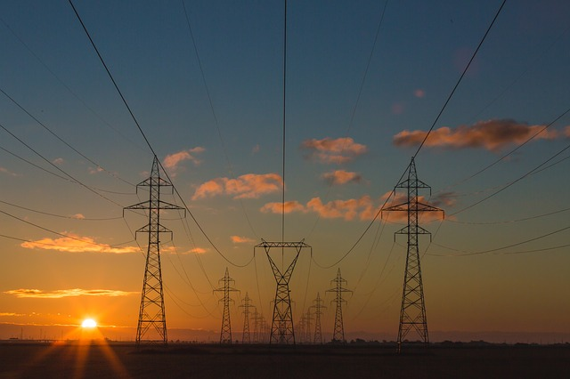

# Electricity consumption in different regions - analysis of data from Gapminder project

[Gapminder](https://www.gapminder.org/data/) is website that gathers wide range of demographic, economic and social data from countries all over the world. I tried to find out how technology indicators (PC or phone ownership per 100 people, for example) differ in countries with high electricity consumption and low electricity consumption. Electricity consumption here is residentual electricity use per person in kilowatt/hours. I analyzed data from years 2000 and 2005 in 116 countries.

This was study project for online course [Data Analyst Nanodegree from Udacity](https://www.udacity.com/course/data-analyst-nanodegree--nd002).

Source:Pixabay

### Instalation

- Jupyter Notebook
- Python 3.6
- Anaconda

### Methods used

- data wrangling with Pandas
- exploratory data analysis with Matplotlib

### Conclusion and main findings

There is huge gap between countries with high and low electricity consumption in all tech indicators (with exception of urbanization) as well as in income. Even though differences in phone and computer ownerships and number of internet users are getting smaller over time, gap in income and urbanized population remains barely unchanged. In 2005 countries with electricity consumption had on average almost 3 times more personal phones and almost 8 times more personal computers than in countries with low electricity consumption. Income was 5,5 times higher in countries with high electricity consumption.

### Authors

* **Kamila Hamalcikova**
* **Udacity**

### License

This project is licensed under the MIT License - see the [license](https://opensource.org/licenses/MIT) file for details
